### 实验二——调试分析 Linux 0.00 多任务切换

#### 1.当执行完 `system_interrupt` 函数，执行 `153` 行 `iret` 时，记录栈的变化情况。

​		将`iret`地址设为断点，执行到`iret`前，现在栈顶SS:ESP指向0x10:0x0E4C，并且可以看见内核栈栈顶的中断返回地址0x0F:0x10EB 和用户栈栈顶地址0x17:0x0BD8：

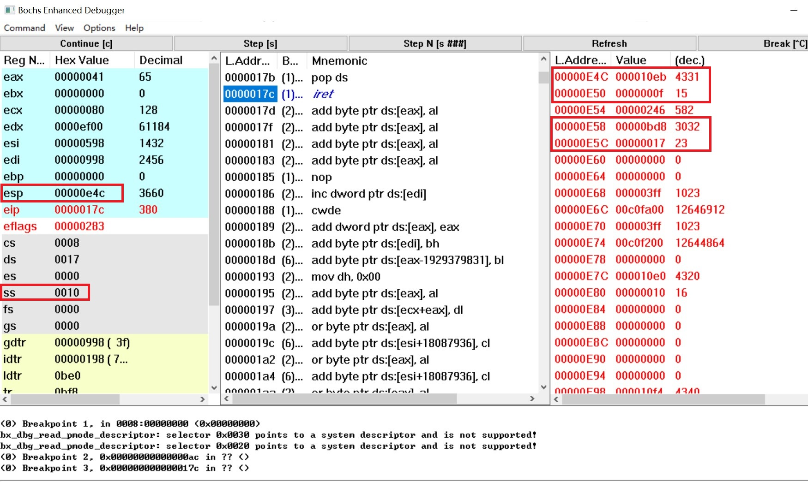

​		执行 `153` 行 `iret` 后，栈顶SS:ESP被切换到了0x17:0x0BD8，并且中断返回到了0x0F:0x10EB处。

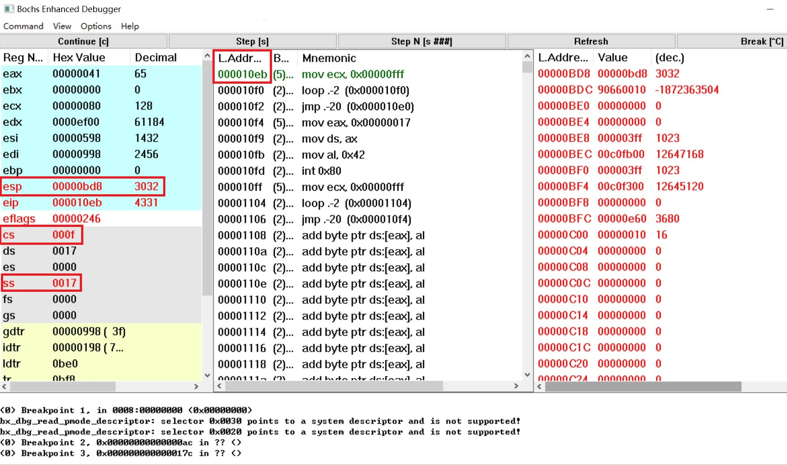

#### 2.当进入和退出 `system_interrupt` 时，都发生了模式切换，请总结模式切换时，特权级是如何改变的？栈切换吗？如何进行切换的？

​		当进入和退出`system interrupt`时，都发生了模式切换。进入系统中断时，硬件将各寄存器的值压入系统栈后，查找其中断向量表后，根据描述符的格式，cs值变为0x08，此时，cs标志着由用户模式切换至内核模式，特权级也由了变为0，栈也切换至系统栈。

​		退出系统中断时，由于处于特权级0的代码不能直接把控制权转移到特权级了的代码中执行，但中断返回操作`iret`是可以的，可利用中断返回指令`iret`来启动第一个任务。具体实现方法是在初始堆栈`init stack`中人工设置一个返回环境。

​		把任务0的TSS段选择符加载到任务寄存器LTR中、LDT段选择符加载到LDTR中以后，把任务0的用户栈指针和代码指针以及标志寄存器值压入栈中，然后执行中断返回指令`iret`。该指令会恢复任务0的标志寄存器内容，并且弹出栈中指针放入CS:EIP中，从而开始执行任务0的代码，完成了从特权级0到特权级了代码的控制转移，模式由内核模式转换为用户模式。

#### 3.当时钟中断发生，进入到 `timer_interrupt` 程序，请详细记录从任务 `0` 切换到任务 `1` 的过程。

​		时钟中断处理程序`timer_interrupt`的入口地址0x0000012C处的指令“mov eax,0x00000010”处插入断点，执行至此条指令之前。

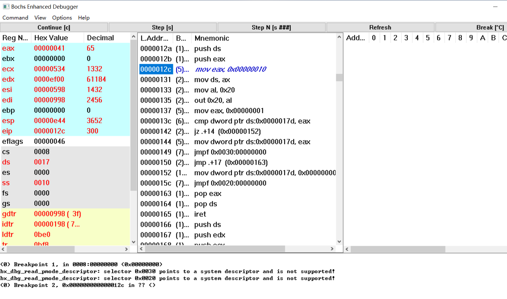

​		此时第一次执行的任务0已经打印出了几个A，但是任务1还未执行过，还没有打印出来B：

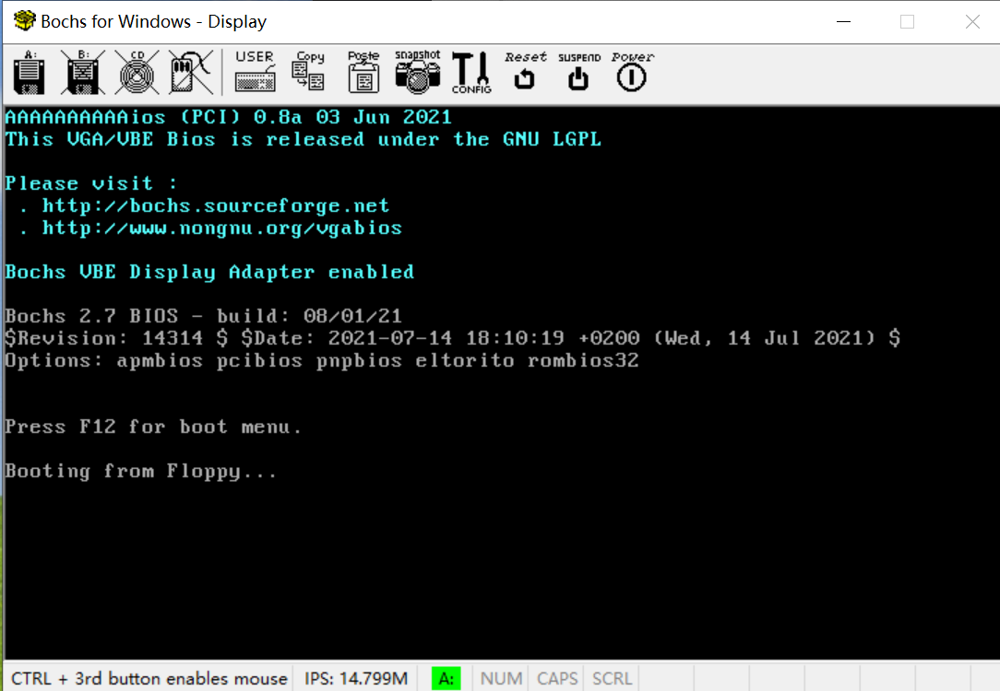

​		之后逐步运行到处理器将要执行位于0x08:0x0149处的远转移指令“jmpf 0x30:0”。这条远转移指令意图将一个TSS 选择子装入CS。这条指令的选择子是0x30，GDT表中0x30是一个还未执行的TSS选择子。

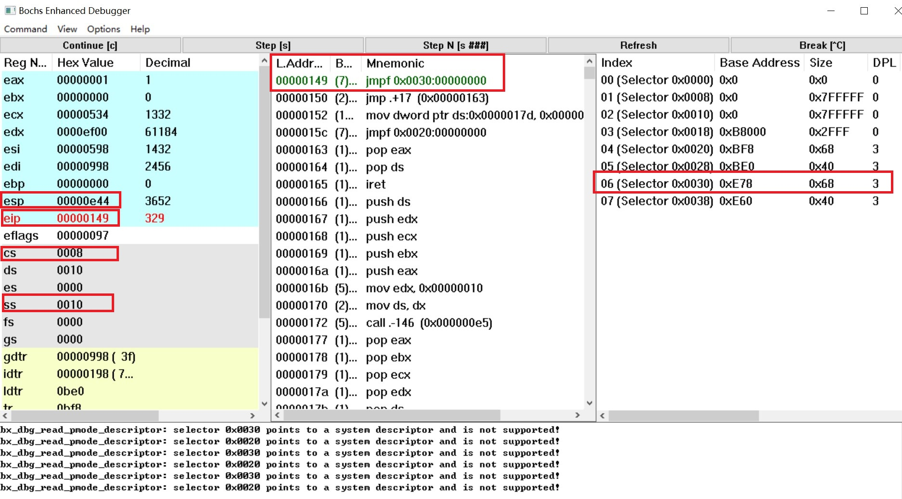

​		输入调试命令“info tss”，看一下任务切换前的TSS：

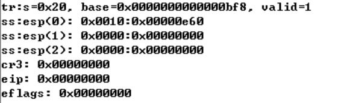

​		执行之后寄存器变化：

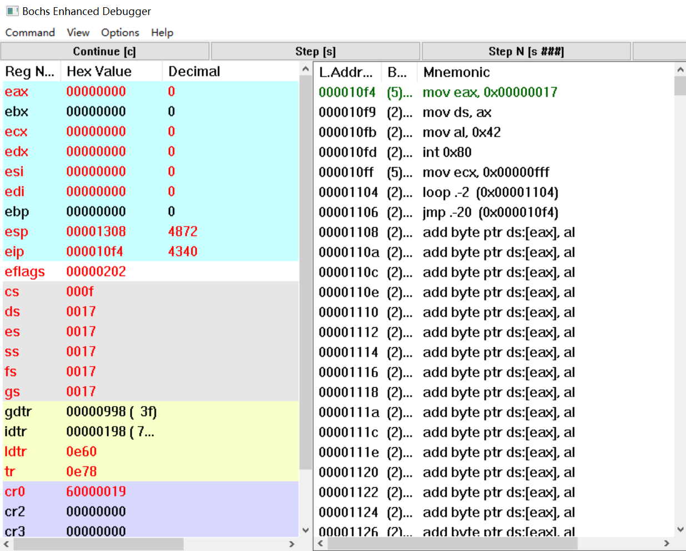

​		现在已经切换到任务1，由于任务1是第一次执行，直接跳转到了用户程序task1的入口处。可以发现相比于前面，各个寄存器的值发生了很大变化。然后再查看现在的TSS：

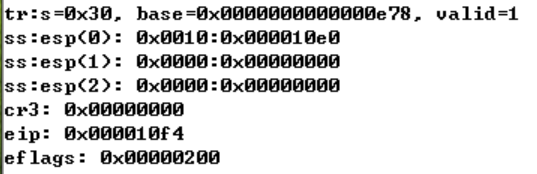

​		TSS发生了改变，并且现在各个寄存器的值和TSS里的各个字段是一致的，任务切换时会根据TSS的各个字段修改寄存器。

#### 4.又过了 `10ms` ，从任务`1`切换回到任务 `0` ，整个流程是怎样的？ `TSS` 是如何变化的？各个寄存器的值是如何变化的？

​		在时钟中断处理程序入口处设置断点，运行到下一次时钟中断发生为止。查看GDT，0x20是另一个TSS选择子。

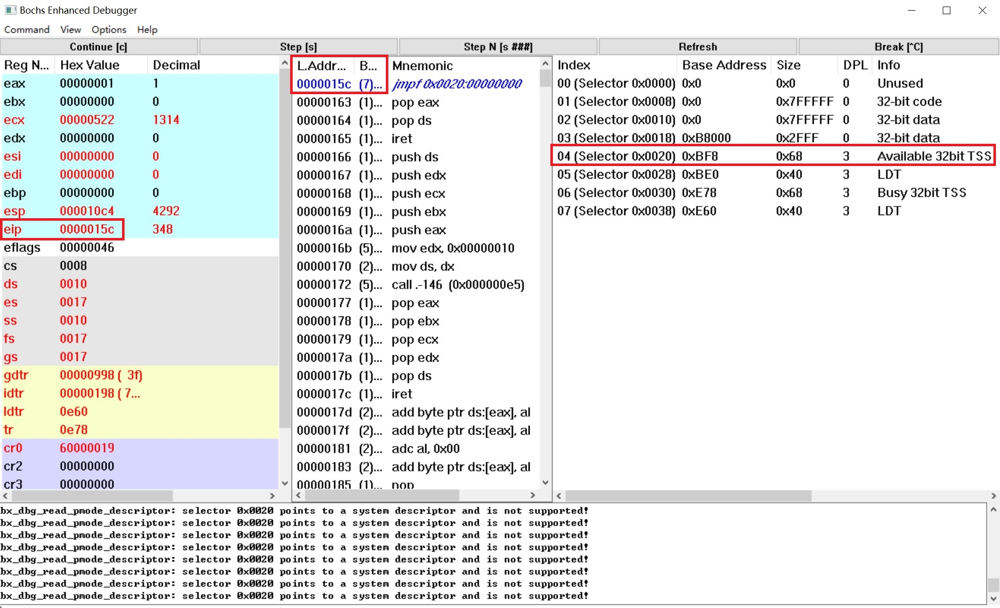

​		查看当前的TSS：

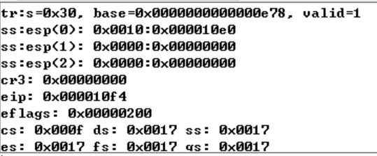

​		第二次任务切换后，由于第一次任务切换时将寄存器现场保存到了TSS0里，因此将TSS0切换回来后，CS:EIP 会指向第一次任务切换的下一条地址，也就是0x08:0x0150。

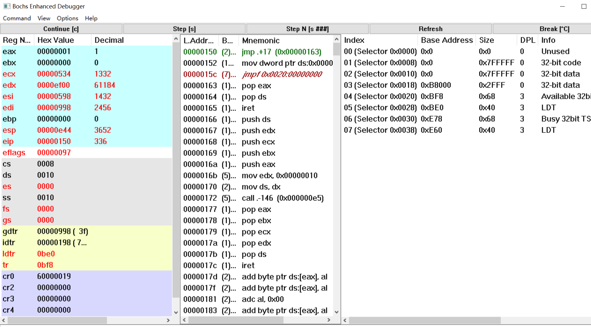

​		查看当前TSS，显示CS:EIP确实是0x08:0x0150。

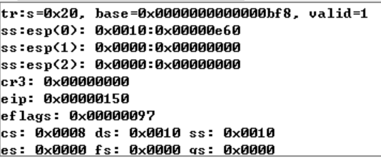
